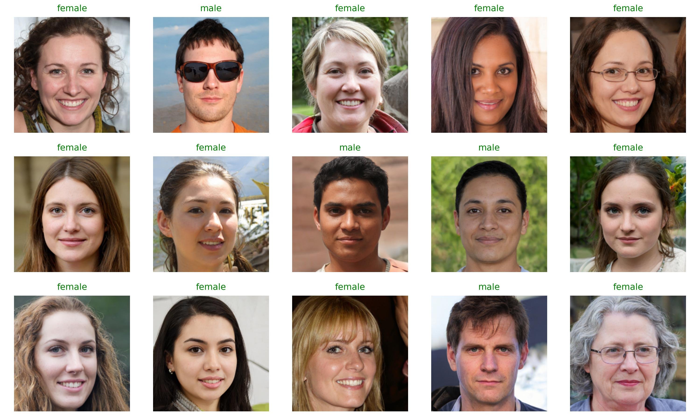

# GenderClassifier
一个基于Resnet的PyTorch人脸性别分类器

## 使用前准备
1. 安装python3.7及以上版本
2. 安装requirements.txt中的依赖库
```shell
python -m pip install -r requirements.txt
```
## 数据处理
### 数据标记
4. 将未标记照片放入dataset/unmark路径
5. 使用jupyter打开data_marker.ipynb标记数据
### 数据集预处理与划分
6. 运行dataset_preprocessor_divider.py    
   进行数据集预处理与划分
## 训练
7. 运行train.py,验证集精度大于99%的模型将会保存至models/     
   训练时可通过TensorBoard观察训练误差与精度
```shell
tensorboard --logdir ./runs
```
访问 http://localhost:6006/
## 测试
8. 运行test.py    
   评估 models/ 路径下模型在验证集与测试集上的精度,并排序输出结果
## 预测
9. 运行predict.py  使用模型预测图片
## 查看训练效果
10. 运行show.py   
    通过TensorBoard查看样例，错误标记数据，pr曲线，模型结构
## 数据集
我们的模型使用13600张有标注的标准证件照训练,由于版权因素我们无法提供数据集
## 预训练模型
预训练模型链接：https://drive.google.com/file/d/1jIYn6kX3rg6rNWOxksiA7VQCyeKu2M9B/view?usp=sharing